# BigDogBarkBarkBark — 游戏整体系统设计

> 版本：v0.5  
> 引擎：Unreal Engine 4.27  
> 类型：简化固定路线 RTS  
> 关联文档：[设计文档0617.docx](c:/Users/lijun/Desktop/Dogbark/设计文档0617.docx)（剧情与数值来源）  
> 修订源：[SystemDesign0712.docx](c:/Users/lijun/Desktop/SystemDesign0712.docx)

### v0.5.2 变更摘要

- **战斗模式到敌端终点**：驻守（停住站岗，感知到敌人再开战）；不折返、不销毁

### v0.5.1 变更摘要（对齐 SystemDesign0712）

- 摄像机改为 **A/D 平移 + 滚轮缩放**
- BOSS 机制具体化（狐狸首领 80 血召唤 3 狐等）
- 野鹿特性改为「穿刺：给第二排单位 10 穿透伤害」；浣熊采集速度标记暂不实装
- 击杀敌人 **10% 概率掉落 5 饲料**
- 关卡 1 波次调整为 **4 波**（首波 10s）
- 主菜单 / 关卡选择：Release 阶段 **要做**

### v0.5 变更摘要

- 确定全 5 关 **战斗道数量 + 采集点数量** 配置表（采集点布设在战斗道上）

### v0.4 变更摘要

- **取消独立采集车道**：地图仅有一种车道（战斗道），采集资源点沿车道布设
- 采集模式单位沿**同一战斗道**前往道上的资源点采集，折返基地

### v0.3 变更摘要

- **所有农场单位**均可在地图中切换采集/战斗模式（不再限定鸡/兔）
- 鸡/兔保留 **采集效率 x2** 作为数值特性，而非模式权限
- **仅采集模式**单位可重叠、无碰撞（与车道类型无关）
- **采集模式**遇袭不中断采集、不反击

---

## 1. 文档定位

本文档描述 **游戏整体系统架构**，覆盖全部 5 个关卡的目标形态，独立于具体代码实现细节。  
关卡 1 最小原型的实现范围见 `.cursor/plans/` 中的「固定路线 RTS 原型」计划。

| 文档 | 职责 |
|------|------|
| 设计文档0617 | 剧情、关卡叙事、兵种数值、BOSS 设定 |
| **本文档（SystemDesign）** | 系统划分、模块边界、数据流、状态机、分期交付 |
| 实现计划 | 关卡 1 可玩原型的具体 C++ 类与验收标准 |

---

## 2. 设计愿景与核心支柱

### 2.1 一句话描述

玩家扮演农场主，指挥农场动物沿固定路线抵御野兽入侵，在资源分配与出兵节奏中完成防守与反击，最终理解并促成人与自然和解。

### 2.2 四大设计支柱

| 支柱 | 说明 | 系统体现 |
|------|------|----------|
| **低操作门槛** | 不做微操，单位自动移动/战斗/采集 | 固定路线 + 自动战斗 AI；**所有农场单位**可在地图中切换采集/战斗模式 |
| **高策略深度** | 资源分配、兵种搭配、出兵时机 | 双资源经济 + 波次节奏 |
| **叙事驱动关卡** | 每关有明确目标与 BOSS 战 | 关卡系统 + 剧情触发器 |
| **生态主题** | 从对抗到理解 | 关卡 5 结局翻转 |

### 2.3 与同类游戏的差异

- **非传统 RTS**：无自由选点、无框选微操、无 NavMesh 寻路
- **固定路线（Lane-based）**：类似塔防/车道战斗，单位沿 `Spline` 推进
- **双资源循环**：饲料（征兵）+ 灵魂（局内成长），形成「采集 → 出兵 → 击杀 → 升级」闭环

---

## 3. 游戏整体架构

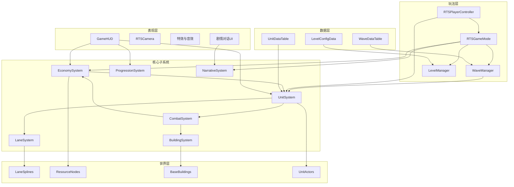

---

## 4. 核心游戏循环

### 4.1 宏观循环（跨关卡）

```
主菜单 → 选择关卡 → 关卡加载 → 局内循环 → 关卡结算 → 剧情触发 → 解锁下一关
```

### 4.2 局内循环（单关卡）

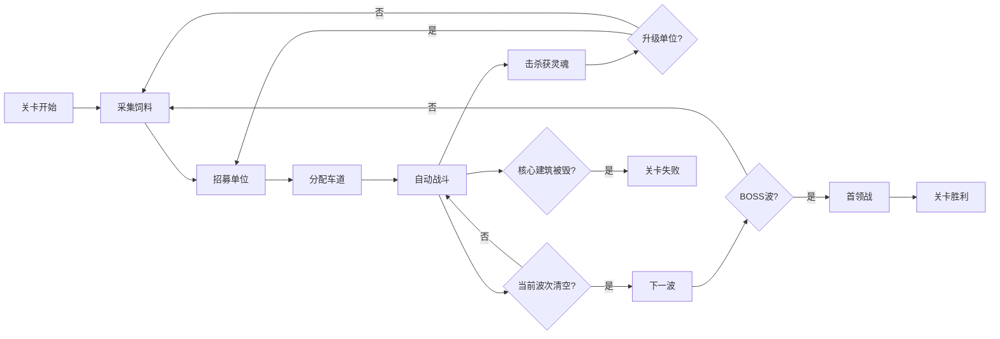

### 4.3 玩家决策点（唯一交互）

| 决策 | 输入方式 | 影响 |
|------|----------|------|
| 招募哪种兵种 | HUD 按钮 / 快捷键 | 消耗饲料，改变战场构成 |
| 分配到哪条车道 | 点击车道 / 招募时选择 | 决定单位沿哪条战斗道移动；采集模式下前往该道上的资源点 |
| **工作模式切换** | 点击已上场任意农场单位 → 切换「采集 / 战斗」 | 决定该单位当前执行采集循环还是战斗推进 |
| 升级哪个兵种 | 单位面板消耗灵魂 | 提升 HP / ATK / 降低造价 |
| 摄像机观察 | A/D 平移 / 滚轮缩放 | 仅观察，不影响玩法 |

> **所有农场单位**（鸡、羊、猪、兔等）上场后均可在地图中随时切换工作模式，不必在招募时固定。鸡/兔在采集模式下享有 **2 倍采集效率** 特性，其余单位为基础效率。

---

## 5. 子系统详细设计

### 5.1 固定路线系统（LaneSystem）

**职责**：定义单位可移动的路径，替代 NavMesh 寻路。

| 概念 | 说明 |
|------|------|
| `ARTSLaneSpline` | 关卡中放置的 Actor，含 `USplineComponent`；**不区分采集/战斗车道** |
| 车道资源点 | `ARTSResourceNode` 挂载在车道上（绑定 `SplineDistance`），战斗与采集共用同一条道 |
| 车道方向 | 玩家单位：基地 → 敌方；敌方单位：生成点 → 基地 |
| **碰撞规则** | **仅 `Collect` 工作模式**的单位关闭单位间碰撞、可重叠；**战斗模式**单位保持物理阻挡 |

**移动规则**：
- 单位绑定到车道后，以 `MoveSpeed` 沿 Spline 弧长推进
- **战斗模式**单位：沿车道向敌方推进；遇到敌人进入 `Combat` 状态，停止推进，原地攻击；同车道战斗单位不可重叠
- **战斗模式 · 到达敌端终点**：`DistanceAlongSpline` 达到车道总长后 **驻守**——停止推进，进入 `Idle`/`Guard`，保持朝向基地方向（面向来敌）；感知范围内出现敌人后再进入 `Combat`；战斗结束后若仍在终点则继续驻守。**不折返、不销毁**
- **采集模式**单位：沿**同一车道**前往该道上的 `ARTSResourceNode` → 到达后停留采集 → 折返基地 → 循环；**遇袭不中断采集**、不反击；采集模式单位之间可重叠
- 切换为战斗模式后：恢复碰撞阻挡，进入战斗逻辑；若当时已过资源点，继续向敌端推进（或已在终点则驻守）

**全关卡车道与采集点配置**（采集点均布设在战斗道上，无独立采集道）：

| 关卡 | 战斗道数 | 采集点数 | 备注 |
|------|---------|---------|------|
| 1 村庄 | 2 | 1 | 单采集点可置于其中一条道上 |
| 2 半荒漠 | 2 | 2 | 建议每道 1 个采集点 |
| 3 湿地 | 1 | 2 | 单道上不同 `SplineDistance` 布 2 点 |
| 4 郊区 | 2 | 2 | 建议每道 1 个采集点 |
| 5 森林 | 3 | 2 | 其中 2 条道各 1 个采集点 |

**关卡1 车道布局示意**：

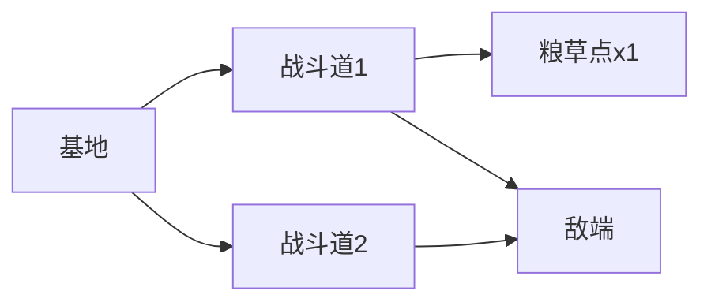

- 战斗单位：沿战斗道向敌端推进交战；到敌端后驻守站岗
- 采集单位：沿同一战斗道前往道上粮草点 → 采集 → 折返基地

---

### 5.2 单位系统（UnitSystem）

**职责**：管理所有可移动战斗/采集实体的生命周期与行为。

#### 单位分类

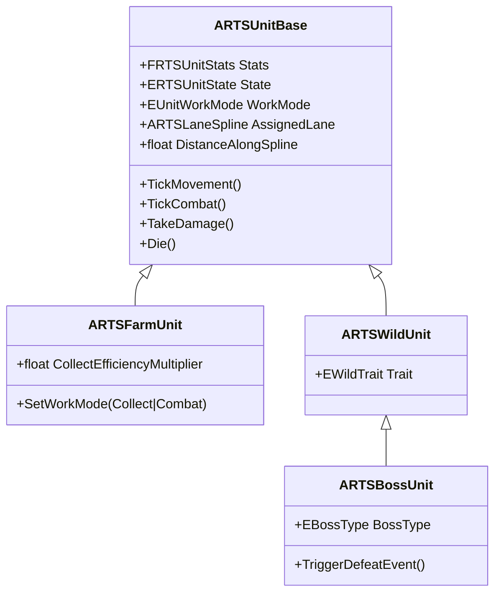

#### 工作模式（所有农场单位）

| 模式 | 枚举 | 行为 |
|------|------|------|
| 采集模式 | `EUnitWorkMode::Collect` | 沿**当前战斗道**前往道上的资源点；**遇袭不中断采集**、不反击；与其他采集模式单位可重叠 |
| 战斗模式 | `EUnitWorkMode::Combat` | 沿战斗道向敌方推进；感知敌人后停步交战；到敌端终点后驻守；不可与战斗模式单位重叠 |

- **所有农场单位**均可在地图中切换 `Collect` / `Combat` 模式
- 切换时机：点击选中已上场单位 → HUD 显示「采集 / 战斗」切换按钮
- 采集效率：`CollectEfficiencyMultiplier`，鸡/兔 = 2.0，其余 = 1.0（仅采集模式下生效）
- 从采集切到战斗：当前采集进度丢弃，恢复碰撞，转入战斗逻辑
- 从战斗切到采集：脱离战斗锁定，沿当前车道前往该道上的最近资源点

#### 单位状态机

**战斗模式**（默认招募模式，或玩家手动切换）：

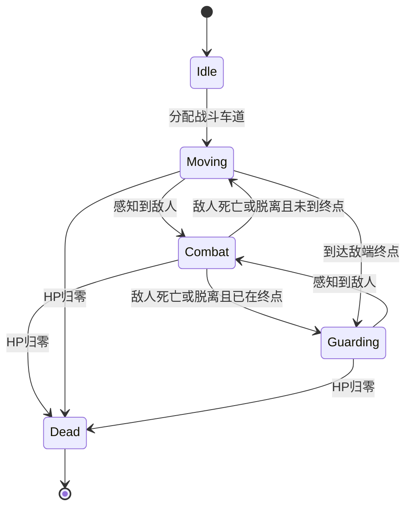

> `Guarding`：在车道敌端驻守，可视为 `Idle` 的子状态；实现上可用 `bReachedLaneEnd` + `Idle` 表示。

**采集模式**（任意农场单位）：

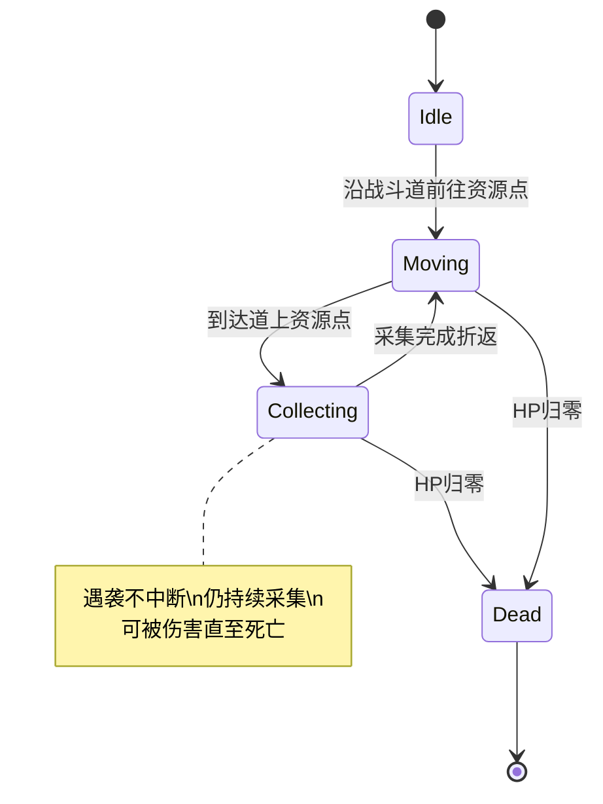

> 采集模式下 **不进入 `Combat` 状态**；敌人可攻击采集单位，但采集单位不停止、不反击。

#### 农场单位全表

| 兵种 | 饲料造价 | HP | ATK | 特性 | 首次出现 |
|------|---------|-----|-----|------|----------|
| 兔 | 12 | 28 | 9 | 采集效率 x2 | 关卡 1 |
| 鸡 | 12 | 22 | 7 | 采集效率 x2 | 关卡 1 |
| 羊 | 20 | 52 | 12 | — | 关卡 1 |
| 猪 | 30 | 65 | 15 | — | 关卡 1 |
| 狗 | 28 | 43 | 18 | — | 关卡 4 |
| 马 | 55 | 75 | 22 | — | 关卡 2 |
| 牛 | 50 | 120 | 14 | 高血量 | 关卡 2 |
| 鹅 | 20 | 36 | 14 | — | 关卡 3 |

#### 野生单位全表

| 兵种 | HP | ATK | 特性 | 首次出现 |
|------|-----|-----|------|----------|
| 狐狸 | 42 | 15 | 偷袭：首击 +20% 伤害 | 关卡 1 |
| 野狼 | 58 | 19 | 群冲：HP<30% 攻速 +50% | 关卡 1 |
| 野鹿 | 50 | 20 | 穿刺：给第二排单位 10 穿透伤害 | 关卡 2 |
| 麋鹿 | 62 | 23 | 缓慢回血：2 HP/s | 关卡 3 |
| 浣熊 | 40 | 15 | 采集速度快（暂不实装） | 关卡 3 |
| 野猪 | 55 | 20 | 击退：攻击附带小幅击退 | 关卡 4 |
| 黑熊 | 135 | 28 | 高血量 | 关卡 2 |

#### BOSS 单位

| 首领 | HP | ATK | 关卡 | 特殊机制 |
|------|-----|-----|------|----------|
| 狐狸首领 | 160 | 25 | 1 | 80 血时，召唤 3 只狐 |
| 狼首领 | 210 | 30 | 2 | HP<30% 攻速 +50% |
| 鹿首领 | 195 | 32 | 3 | 给第二排单位 16 穿透伤害 |
| 野猪首领 | 260 | 36 | 4 | 100 血时向前冲击一段距离 |
| 熊首领 | 320 | 34 | 5 | — |

---

### 5.3 战斗系统（CombatSystem）

**职责**：自动检测、攻击、伤害结算、死亡处理。

| 参数 | 默认值 | 说明 |
|------|--------|------|
| `PerceptionRadius` | 300 uu | 感知敌人范围 |
| `AttackRange` | 150 uu | 攻击距离 |
| `AttackCooldown` | 1.5 s | 攻击间隔 |
| `TargetPriority` | 最近敌人 | 可扩展：优先核心建筑 |

**伤害公式（第一版）**：
```
FinalDamage = Attacker.ATK × TraitModifier - Defender.Armor
Armor 默认 = 0（后续可加）
```

**死亡处理**：
- 播放死亡动画 → 延迟销毁 Actor
- 敌方单位：掉落灵魂（普通 5，BOSS 50）
- 通知 `WaveManager` 更新存活计数
- 通知 `CombatSystem` 解除锁定

**Trait 实现优先级**：

| 优先级 | Trait | 实现方式 |
|--------|-------|----------|
| P0 | 偷袭/群冲/高血量 | 第一版简化数值修正 |
| P0 | 采集模式遇袭不中断 | 采集状态下跳过 `Combat` 状态转换 |
| P1 | 穿透/击退 | 第二版加位移逻辑 |
| P2 | 缓慢回血 / 通用召唤 | 第三版 BOSS 专属 |
| 例外 | 狐狸首领召唤 | **关卡 1 MVP**：HP≤80 时召唤 3 狐（一次） |

**采集模式与战斗的交互**：
- 敌方单位仍可将采集模式单位作为攻击目标
- 采集模式单位 `TakeDamage()` 正常扣血，但不触发状态切换
- 采集模式单位不主动感知、不锁定、不攻击敌人

---

### 5.4 经济系统（EconomySystem）

**职责**：管理局内两种资源的获取与消耗。

#### 资源 1：饲料（Fodder）

| 属性 | 值 |
|------|-----|
| 作用域 | 局内 |
| 初始值 | 50（关卡可配置） |
| 获取 | 采集单位在资源点采集；击杀敌人 **10% 概率掉落 5** 饲料 |
| 消耗 | 招募任意单位 |
| 存储上限 | 999（可配置） |

**采集规则**：
- 基础采集速率：5 饲料 / 3 秒 × `CollectEfficiencyMultiplier`
- 鸡/兔（Multiplier = 2.0）：10 饲料 / 3 秒；羊/猪等（Multiplier = 1.0）：5 饲料 / 3 秒
- 资源点储量：无限（第一版）；后续可加有限储量

#### 资源 2：灵魂（Soul）

| 属性 | 值 |
|------|-----|
| 作用域 | 局内（不跨关卡保留） |
| 初始值 | 0 |
| 获取 | 击杀敌方单位 |
| 消耗 | 单位升级 |
| 掉落 | 普通敌人 5，精英 15，BOSS 50 |

#### 升级系统（ProgressionSystem）

| 阶数 | 消耗灵魂 | 效果 |
|------|---------|------|
| 1 阶 | 30 | 最大 HP +50% |
| 2 阶 | 60 | 攻击力 +50% |
| 3 阶 | 100 | 招募饲料造价 -20% |

- 升级绑定 **兵种类型**（全局），非单个单位实例
- 例：升级「羊」1 阶 → 之后所有新招募的羊 HP +50%

---

### 5.5 建筑系统（BuildingSystem）

**职责**：管理关卡中不可移动的关键实体。

| 建筑类型 | 说明 | 关卡示例 |
|----------|------|----------|
| `CoreBuilding` | 核心防守目标，被毁 = 失败 | 关卡1 鸡圈 |
| `BaseBuilding` | 玩家基地，招募出生点 | 每关固定 |
| `ResourceBuilding` | 可争夺的资源结构 | 关卡2 草场 |
| `DefenseStructure` | 可被攻击的辅助防线 | 关卡4 围栏 |

**CoreBuilding 属性**：
- HP：500（关卡可配置）
- 不可攻击敌人
- 被敌方单位进入攻击范围时成为优先目标

---

### 5.6 波次系统（WaveManager）

**职责**：控制敌方进攻节奏与胜负判定。

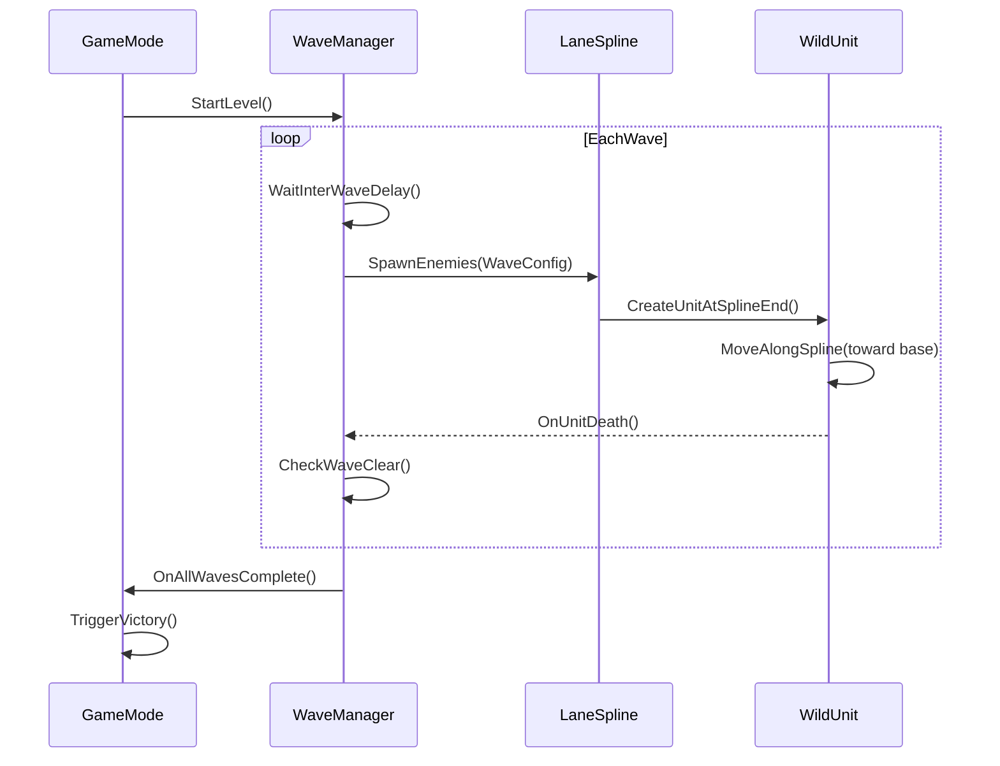

**波次配置数据结构**：

```cpp
USTRUCT()
struct FRTSWaveEntry
{
    ERTSUnitType UnitType;
    int32 Count;
    float SpawnDelay;      // 同波内逐个生成间隔
    int32 PreferredLane;   // -1 = 随机车道
};

USTRUCT()
struct FRTSWaveConfig
{
    TArray<FRTSWaveEntry> Entries;
    float PreWaveDelay;    // 波次开始前的等待
    bool bIsBossWave;
};
```

**关卡 1 波次示例**：

| 波次 | 内容 | 间隔 |
|------|------|------|
| 1 | 狐狸 x2 | 10s 后开始 |
| 2 | 野狼 x2 | 25s |
| 3 | 野狼 x2 + 狐狸 x2 | 30s |
| 4 BOSS | 狐狸首领 x1 + 狐狸 x2 | 30s |

**胜负条件**：

| 结果 | 条件 |
|------|------|
| 胜利 | 所有波次清空 + 核心建筑存活 |
| 失败 | 核心建筑 HP 归零 |
| 平局 | 无（第一版不做超时） |

---

### 5.7 关卡系统（LevelManager）

**职责**：管理 5 个关卡的加载、配置与进度。

| 关卡 | 地图 | 战斗道 | 采集点 | 核心目标 | 可用农场单位 | 敌方 | BOSS |
|------|------|--------|--------|----------|-------------|------|------|
| 1 村庄 | level_1 | 2 | 1 | 保护鸡圈 | 鸡羊猪兔 | 狐狼 | 狐狸首领 |
| 2 半荒漠 | level_2 | 2 | 2 | 争夺草场 | 羊马牛 | 鹿狼熊 | 狼首领 |
| 3 湿地 | level_3 | 1 | 2 | 突破伏击 | 鸡鹅牛 | 鹿麋鹿浣熊 | 鹿首领 |
| 4 郊区 | level_4 | 2 | 2 | 守卫围栏 | 狗牛马兔 | 野猪浣熊狼 | 野猪首领 |
| 5 森林 | level_5 | 3 | 2 | 抵达森林核心 | 牛马狗猪鸡 | 熊鹿狼野猪 | 熊首领 |

**关卡配置（DataAsset）**：

```cpp
UCLASS()
class URTSLevelConfig : public UDataAsset
{
    TSoftObjectPtr<UWorld> LevelMap;
    int32 CombatLaneCount;          // 战斗道数量
    int32 ResourceNodeCount;        // 采集点数量（布设在战斗道上）
    TArray<FRTSWaveConfig> Waves;
    TArray<ERTSUnitType> AvailableFarmUnits;
    int32 StartingFodder;
    FText LevelName;
    FText VictoryText;
    FText DefeatText;
    TSoftObjectPtr<UTexture2D> LevelThumbnail;
};
```

**关卡进度**：
- 本地存档：`SaveGame` 记录已解锁关卡
- 通关关卡 N → 解锁关卡 N+1

---

### 5.8 叙事系统（NarrativeSystem）

**职责**：在关卡开始/胜利/失败时触发剧情文本。

| 触发点 | 内容 | 第一版 |
|--------|------|--------|
| 关卡开始 | 背景介绍 | 纯文字弹窗 |
| BOSS 战前 | 首领台词 | 延后 |
| 关卡胜利 | 剧情结果 + 解锁下关 | 纯文字弹窗 |
| 关卡 5 胜利 | 和解结局 | 完整演出（最终版） |

**实现方式**：
- `UNarrativeDataTable`：每关 3~5 条 `FText` 对话
- `URTSNarrativeWidget`：UMG 对话框，点击继续
- 与 `LevelManager` 的 Win/Lose 事件挂钩

---

### 5.9 UI 系统

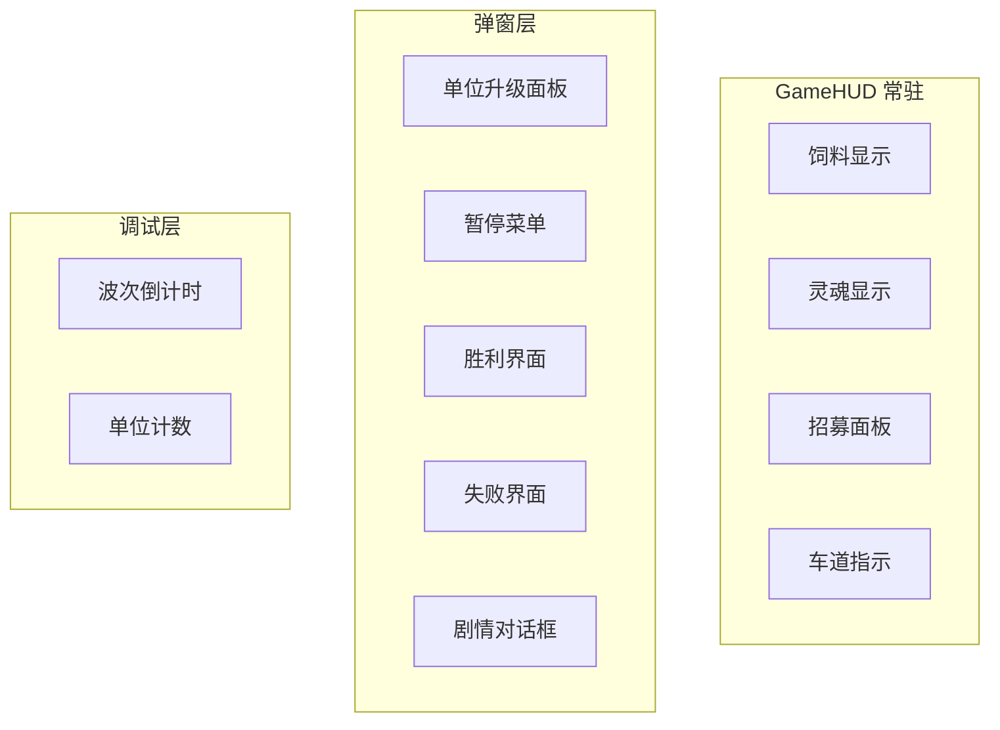

| UI 元素 | 数据源 | 交互 |
|---------|--------|------|
| 饲料计数 | `EconomySystem.Fodder` | 只读 |
| 灵魂计数 | `EconomySystem.Soul` | 只读 |
| 招募按钮 x N | `LevelConfig.AvailableUnits` | 点击 → 选车道 → 扣饲料 → 生成 |
| **工作模式切换** | 选中任意农场单位 → Collect/Combat 按钮 | 切换已上场单位的行为模式 |
| 升级面板 | `ProgressionSystem` | 点击兵种 → 显示 3 阶升级 → 扣灵魂 |
| 波次提示 | `WaveManager.CurrentWave` | 只读 |

---

## 6. 数据流总览

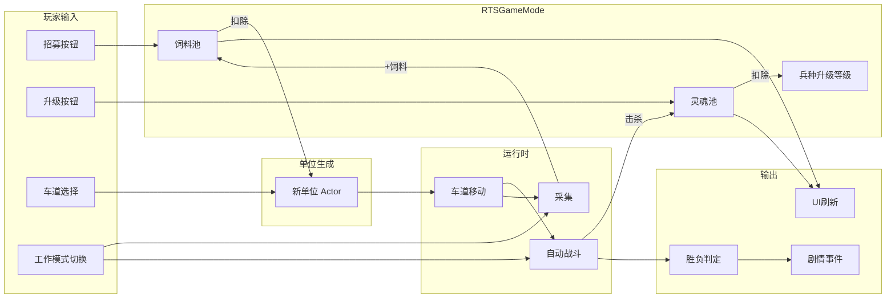

---

## 7. 技术架构

### 7.1 C++ 与 Blueprint 分工

| 层 | C++ | Blueprint |
|----|-----|-----------|
| 核心逻辑 | GameMode, Unit, Combat, Economy, Wave | — |
| 数据配置 | Struct, Enum, DataAsset 基类 | DataAsset 实例（波次/关卡/单位数值） |
| 视觉表现 | — | 单位 BP（Mesh/Anim）、特效、UI Widget |
| 关卡装配 | Actor 基类 | 关卡中放置 Spline/Building/ResourceNode |

### 7.2 模块依赖（目标态）

```csharp
// BigDogBarkBarkBark.Build.cs
PublicDependencyModuleNames.AddRange(new string[] {
    "Core", "CoreUObject", "Engine", "InputCore",
    "UMG", "Slate", "SlateCore"
});
// 后续如需存档：添加 "Engine" 内置 SaveGame 即可，无需额外模块
```

### 7.3 目录结构（目标态）

```
Source/BigDogBarkBarkBark/
├── Core/           # GameMode, PlayerController, Camera
├── Lane/           # LaneSpline
├── Unit/           # UnitBase, FarmUnit, WildUnit, BossUnit, UnitTypes
├── Combat/         # CombatComponent（可选）
├── Economy/        # EconomySubsystem 或 GameMode 内嵌
├── Building/       # BaseBuilding, CoreBuilding
├── Wave/           # WaveManager, WaveConfig
├── Level/          # LevelManager, LevelConfig, SaveGame
├── Narrative/      # NarrativeManager
└── UI/             # GameHUD, UpgradePanel, DialogWidget
```

### 7.4 关键类关系

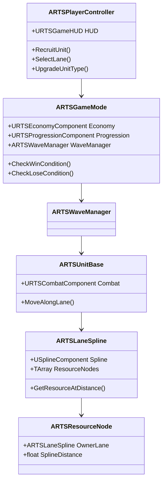

---

## 8. 分期交付路线图

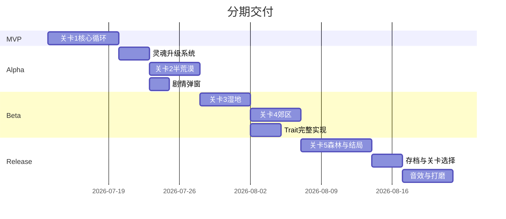

| 阶段 | 交付内容 | 验收标准 |
|------|----------|----------|
| **MVP** | 关卡 1：固定路线 + 饲料 + 招募 + 自动战斗 + 鸡圈防守 | 可完整打完关卡 1 并胜负 |
| **Alpha** | + 灵魂升级 + 关卡 2 + 基础剧情弹窗 | 2 关可通关，升级有感 |
| **Beta** | + 关卡 3~4 + 完整 Trait + 关卡选择 | 4 关可通关 |
| **Release** | + 关卡 5 结局 + 存档 + 音效/UI 打磨 | 完整 5 关流程可玩 |

---

## 9. 非功能需求

| 类别 | 要求 |
|------|------|
| 性能 | 同屏 ≤ 50 单位，60 FPS（PC） |
| 平台 | PC（Win64），UE 4.27 |
| 操作 | 仅鼠标 + 键盘快捷键，无手柄 |
| 存档 | `USaveGame` 本地存储关卡解锁状态 |
| 本地化 | 第一版仅中文，`FText` 预留 |
| 调试 | `WaveManager` 提供 SkipWave / AddFodder 控制台命令 |

---

## 10. 开放问题（待后续确认）

| # | 问题 | 影响范围 |
|---|------|----------|
| ~~1~~ | ~~同车道多单位是否允许重叠？~~ | **已决**：仅采集模式单位可重叠（无独立采集道） |
| ~~2~~ | ~~采集单位被攻击时是否中断采集？~~ | **已决**：采集模式遇袭不中断 |
| ~~6~~ | ~~哪些单位可切换工作模式？~~ | **已决**：所有农场单位均可切换；鸡/兔采集效率 x2 |
| 3 | 关卡 2「争夺草场」是资源点易主还是限时占点？ | LevelDesign |
| 4 | 关卡 5 熊首领不攻击如何实现「不主动进攻」？ | Narrative + Combat |
| ~~5~~ | ~~是否需要主菜单 / 关卡选择界面？~~ | **已决**：Release 阶段要做 |
| ~~7a~~ | ~~战斗模式走到车道终点怎么办？~~ | **已决**：驻守终点（方案 A） |
| 7 | 战斗模式切回采集模式时，是否需先回到基地？ | UnitSystem |
| ~~8~~ | ~~是否单独设置采集车道？~~ | **已决**：否；资源点布设在战斗道上 |

---

## 附录 A：与实现计划的对应关系

| 系统设计模块 | 实现计划阶段 | MVP 是否包含 |
|-------------|-------------|-------------|
| LaneSystem | 阶段 2 | 是 |
| CombatSystem | 阶段 3 | 是 |
| EconomySystem（仅饲料） | 阶段 4 | 是 |
| WaveManager | 阶段 5 | 是 |
| ProgressionSystem（灵魂） | Alpha | 否 |
| NarrativeSystem | Alpha | 否 |
| LevelManager（多关） | Beta~Release | 否 |
| BuildingSystem（多类型） | Beta | 否（MVP 仅 CoreBuilding） |
